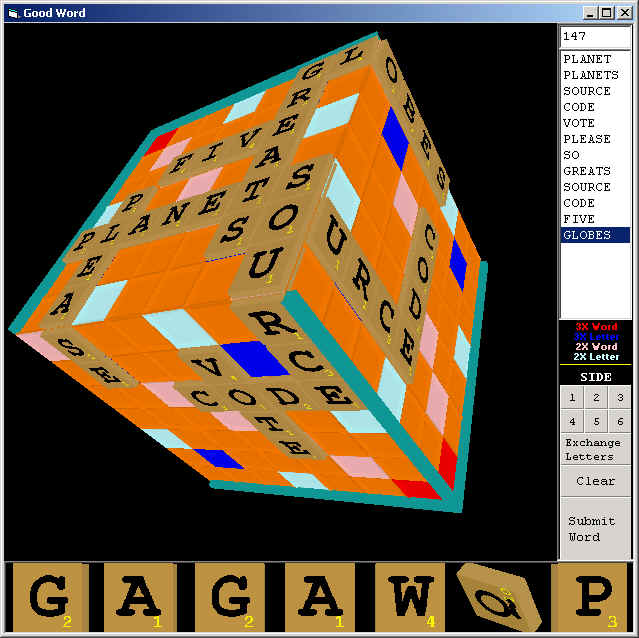



## QSCRAB \- 3D Cubic Scrabble ™

### Description

***UPDATED WITH USER REQUESTS***

A one-player 3D scrabble™ game using DirectX7. Has a 250,000 word dictionary (plain text). Will check and verify the words. Uses standard scrabble™ rules and scoring - except you can build words around corners. It is lots of fun. To Play, simply click on a letter in the 'rack' and then rotate the cube and click the space you want to place the letter.

I might end up modifying the game to be 2-player over the TCP/IP if enough interest and positive feedback is given.

If you think it's worthy of a vote, then vote. I would appreciate any user feedback and suggestions to improve this game.

Enjoy!
 
### More Info
 

             |
---                |---
**Submitted On**   |2002-05-03 14:13:58
**By**             |[Dave Andrews](https://github.com/Planet-Source-Code/PSCIndex/blob/master/ByAuthor/dave-andrews.md)
**Level**          |Advanced
**User Rating**    |4.9 (97 globes from 20 users)
**Compatibility**  |VB 5\.0, VB 6\.0
**Category**       |[Games](https://github.com/Planet-Source-Code/PSCIndex/blob/master/ByCategory/games__1-38.md)
**World**          |[Visual Basic](https://github.com/Planet-Source-Code/PSCIndex/blob/master/ByWorld/visual-basic.md)
**Archive File**   |[QSCRAB\_\-\_378939532002\.zip](https://github.com/Planet-Source-Code/dave-andrews-qscrab-3d-cubic-scrabble__1-34351/archive/master.zip)

